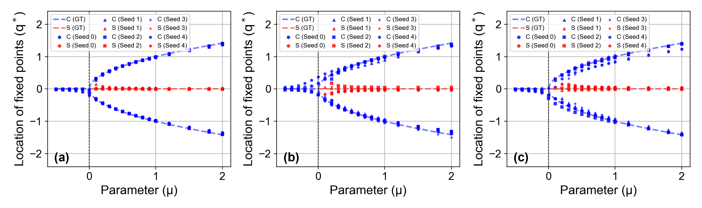

# ICML 2025 Submission 7637 Rebuttal Figures

## Figure 1

**Figure 1. Reliability of the zero-shot bifurcation identification.** Bifurcation diagrams generated by context-informed models trained under three different settings: **(a)** the default setting (Section 3.1); **(b)** the noisy setting, where Gaussian noise $n \sim N(0, 0.02)$ is added to the trajectories to mimic measurement noise. Because the bifurcation begins to emerge near $x^* = (0, 0)$, this small noise can cause appreciable variations, especially near the critical point $\mu = 0$; **(c)** the limited data setting, where only two initial conditions are used per parameter, compared to four in the default setting. Each setting is repeated five times with random initializations.
***
## Figure 2

**Figure 2. Detecting the hallcuinated bifurcation.** Ensembled bifurcation diagrams generated using a $k$-fold deep ensemble of context-informed models trained on **(a)** the double-well potential (Section 3.1) and **(b)** the linear Hamiltonian system (Section 4.3). Each ensemble model consists of $k$ sub-NODEs, independently trained on bootstrapped datasets with different initializations and random seeds. In the legend, ‘C’ and ‘S’ denote the center of orbits and saddle point, respectively, while ‘GT’ refers to the ground truth and ‘Sub $k$’ indicates the $k$-th sub-model in the ensemble. In (a), the symmetry-breaking bifurcation is the correct behavior, and the ensemble shows low variance consistently. In contrast, the true bifurcation in (b) is a center-to-saddle transition at $q^* = 0$. However, the model incorrectly generates two centers of orbits in the range of $0 < μ < 0.5$, representing hallucinated behavior. This results in low variance near the actual transition and high variance in the spurious bifurcation region.
***
## Figure 3

**Figure 3. Zero-shot bifurcation identification in a codimension-2 cusp bifurcation system.** This system serves as a canonical model for catastrophic transitions and hysteresis, and is widely applied in phase transition theory. **(a)** Bifurcation surface generated by the context-informed model trained on a codimension-2 cusp bifurcation system. Only monostable, pre-bifurcation parameters $(a_{tr}, b_{tr}) \in [-2.0, -1.5, -1.0, -0.5]^2$ are used for training (shown as black crosses). For each training parameter vector, four training trajectories are sampled with initial conditions $(x, y) \sim U([-2.0, 2.0]^2)$. After training, the bifurcation surface is generated by constructing a mesh grid over $(a_{test}, b_{test}) \in [-2.0, 2.0]^2$ with an interval of $0.1$, mapping these points to context vectors via linear regression,  and then identifying the corresponding fixed points using the inverse optimization technique described in Section 3.1 (specifically, Appendix B). The automatically identified cusp catastrophe surface is highlighted in pink. **(b)** Comparison between the phase portrait of the ground truth system (black lines) and the learned vector fields (red lines) with varying parameter conditions.
***
## Figure 4

**Figure 4. Computational cost of topological regularization.** Comparison between the vanilla and regularized models in terms of **(a)** regularization values and **(b)** test MSE over normalized wall-clock time. The vertical dashed line marks the point at which topological regularization is activated. The regularization value is defined by Equation (5) in the main text. While both models compute this value, only the regularized model is explicitly trained to minimize it. The vanilla model occasionally exhibits decrease in the regularization value as it implicitly learns certain topological patterns from data, but its efficiency is significantly lower than the explicitly regularized one. This difference leads to faster convergence and better predictive accuracy in the regularized case, as shown in (b). The benchmark follows the experimental setup described in Section 5.
***
## Figure 5

**Figure 5. Effect of the global topological regularization.** Contour plots of mean consistency scores for the **(a)** conventional context-informed NODE and **(b)** regularized one. Unlike in Section 5, the training data in this experiment is restricted to samples from $(\psi, \psi') \sim U([-1.0, 1.0]^2)$, and only global regularization is applied for (b). All other settings are identical to those in Section 5.
***
